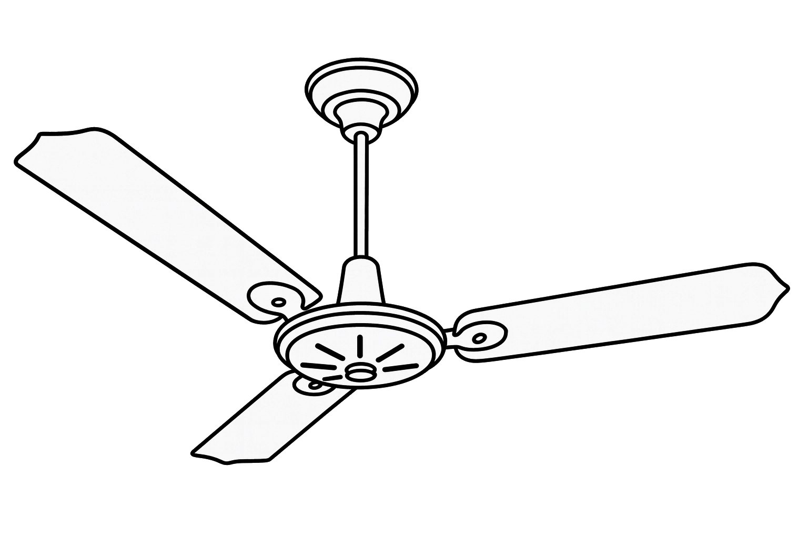
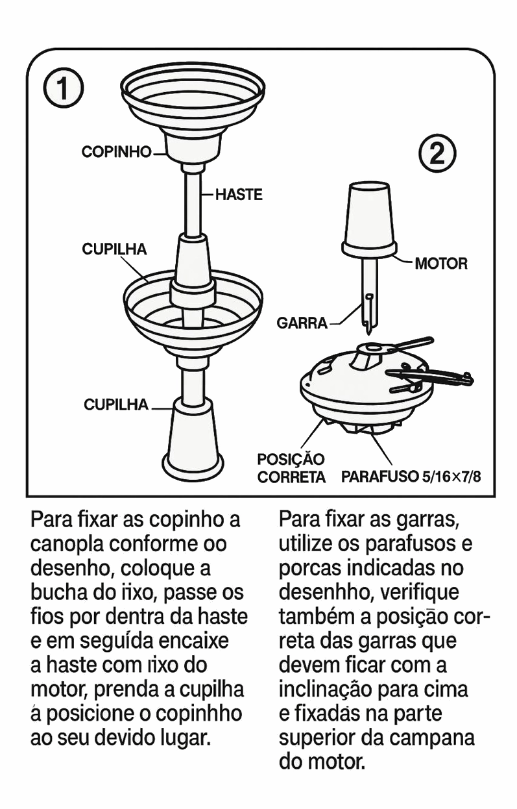
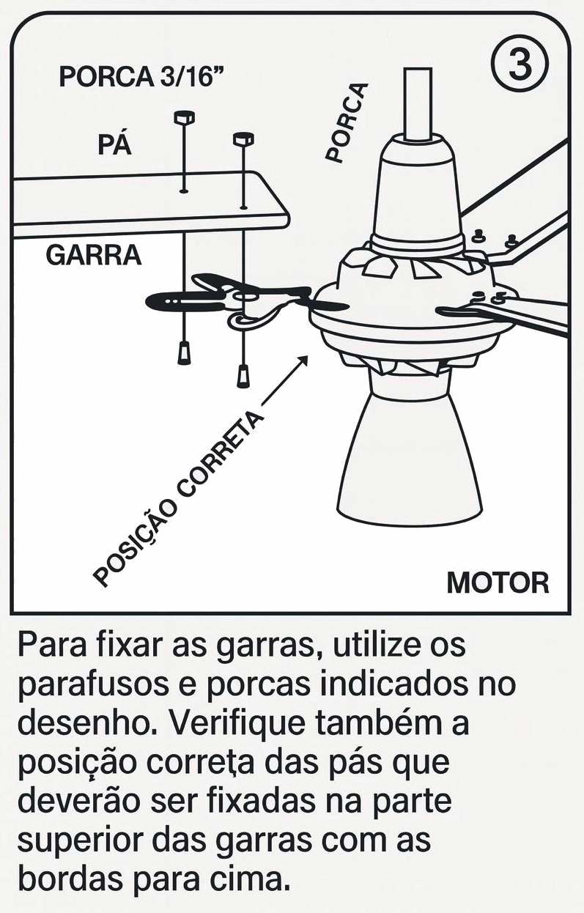
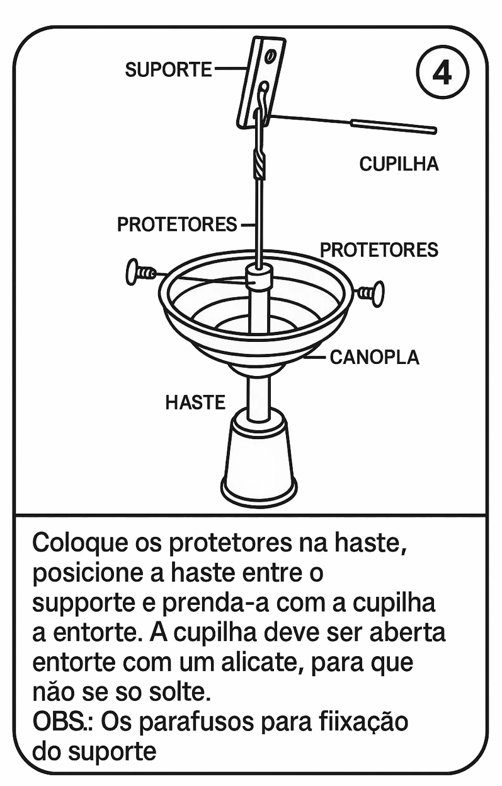
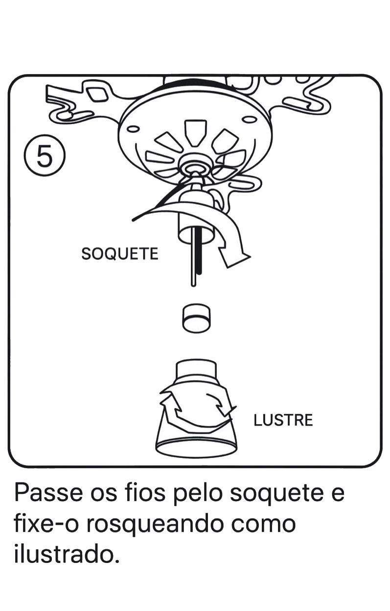
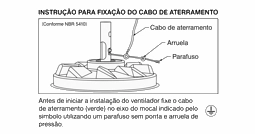
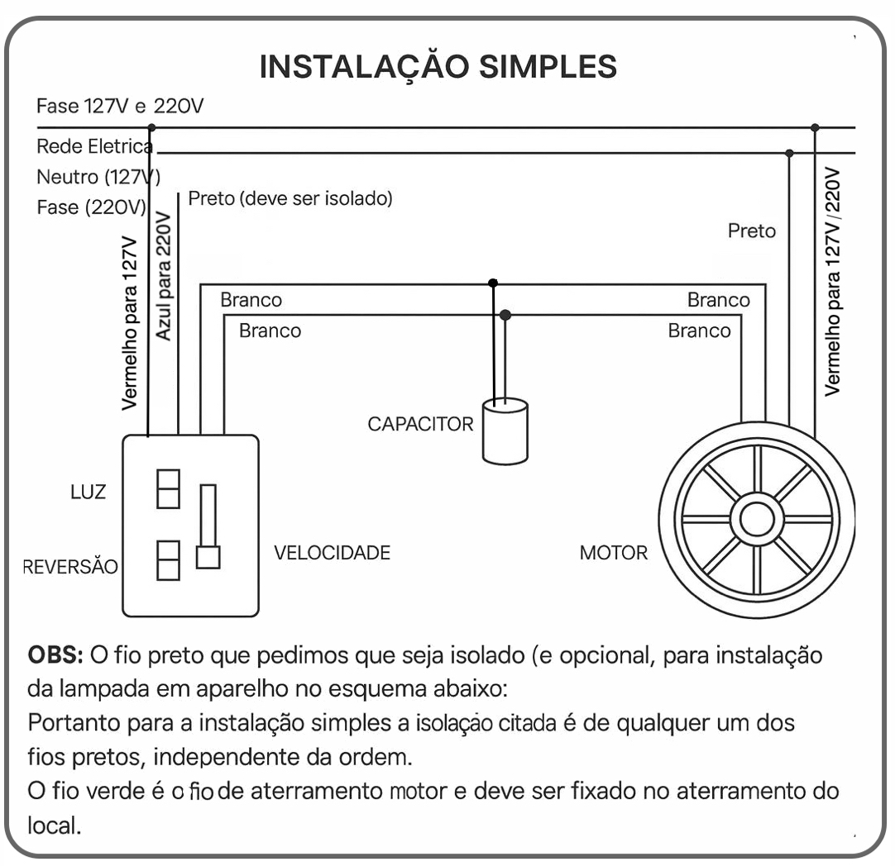

<td style="width: 10%;"></td>

## **CENTRO FEDERAL DE EDUCAÇÃO TECNOLÓGICA DE MINAS GERAIS**  
## **Departamento de Engenharia Elétrica - CEFET-MG**  
## **Coordenação do Curso de Eletrotécnica**  

## Disciplina: **PLIP - Prática de Laboratório de Instalações Prediais**
## Guia de Aula – Ventilador de Teto 

## Objetivo da Aula
Ensinar os princípios de funcionamento, instalação, ligação elétrica, manutenção e normas de segurança relativas ao ventilador de teto ARGE.

## 1. Introdução
Os ventiladores de teto são robustos, silenciosos e eficientes, utilizando motor monofásico com capacitor permanente.

## 2. Componentes - Ventilador de Teto 

### 2.1. Motor Monofásico (PSC – Permanent Split Capacitor)
O motor utilizado nos ventiladores de teto ARGE é do tipo Indução Monofásica com capacitor permanente (PSC).

### Características técnicas
- Tipo: Motor de indução monofásico  
- Topologia: Rotor gaiola de esquilo  
- Frequência: 50/60 Hz  
- Isolamento: Classe B  
- Tensão: 127 V ou 220 V  
- Potência nominal: 130 W  
- Rotação: 390 a 470 rpm  
- Projeto: 4 pólos  
- Refrigeração: Convecção natural  
- Acoplamento: Eixo com flange

### Funcionamento
O motor PSC possui bobina principal, bobina auxiliar e capacitor permanente em série, gerando defasagem elétrica e torque de partida.

---

### 2.2. Hélices (Pás)
Responsáveis pela movimentação do ar por meio de diferença de pressão.

### Características técnicas
- Material: MDF prensado  
- Acabamento: Pintura UV ou laminado  
- Geometria: Perfil plano levemente torcido  
- Comprimento: 40 a 55 cm  
- Fixação: Parafusos M4  
- Balanceamento: Feito em fábrica

---

### 2.3. Suporte (Fixação ao Teto)
Elemento que fixa o ventilador à estrutura do teto.

### Características
- Material: Aço estampado  
- Instalação: Buchas 8–10 mm  
- Função: Suportar 3–5 kg  
- Formato: Base com abertura central  
- Importância: Evita vibrações e quedas

---

### 2.4. Haste (Tubo de Sustentação)
Responsável pela sustentação e passagem interna dos fios.

### Características técnicas
- Material: Aço tubular  
- Comprimento: 15–30 cm  
- Funções: Sustentação, absorção de vibração  
- Diâmetro interno: Para 4–6 condutores 0,75 mm²  
- Fixação: Parafusos superior e inferior

---

### 2.5. Capacitor (Capacitor Permanente)
Componente essencial do motor PSC.

### Especificações
- Tipo: Poliéster ou polipropileno  
- Tensão: 250–450 VAC  
- Capacitância: 4–8 µF  
- Função: Defasar bobinas e permitir partida  
- Sintomas de defeito: Lentidão, ruído, não parte sozinho

---

### 2.6. Chave de Velocidade
Controla velocidades com taps diferentes do motor.

### Características
- Tipo: Chave rotativa (3 velocidades + off)  
- Corrente nominal: 2–6 A  
- Velocidades: Baixa, Média, Alta  
- Importante: Não usar dimmer comum

---

### 2.7. Chave de Reversão (Opcional)
Inverte o sentido da rotação.

### Características
- Tipo: DPDT  
- Modos: Ventilação / Exaustão  
- Funcionamento: Inverte polaridade da bobina auxiliar

---

### 2.8. Lustre (Opcional)
Sistema de iluminação integrado.

### Características
- Soquete: E27 ou G5  
- Material: Acrílico, vidro ou policarbonato  
- Potência recomendada: 5–15 W (LED)  
- Circuito: Independente do motor  
- Função: Iluminação integrada

## 3. Funcionamento
Motor PSC com capacitor 4–8 µF. PSC significa Permanent Split Capacitor, ou Motor de Capacitor Permanente.Ele é um tipo de motor de indução monofásico que usa um capacitor conectado permanentemente ao circuito elétrico para criar o campo magnético necessário para girar.
 
## Características Técnicas
- Potência: 130 W
- Hélices em MDF
- Rotação: 470 rpm (127 V) / 390 rpm (220 V)
- Frequência: 50/60 Hz
- Classe B
- Tensão: 127/220 V

## 4. Instalação

### 4.1 Cuidados Especiais
1. Nunca puxe o ventilador pelos fios.
2. Certifique-se da compatibilidade.
3. Instale a 2,3 m do chão.
4. Desligar energia para manutenção.
5. Manutenção periódica nas pás.
6. Não usar solventes na limpeza.
7. Objetos duros podem causar acidentes.
8. Manutenção da estética e estrutura.
9. Instalar longe de cortinas .

---

## 4.2 Instruções de Montagem
Fixação da haste, motor, pás e suporte, conforme descrito anteriormente.

<table>
  <tr>
    <td></td>
    <td></td>
  </tr>
  <tr>
    <td></td>
    <td></td>
  </tr>
  <tr>
    <td></td>
    <td></td>
  </tr>
</table>

## 4.3 Instalação Elétrica

Escolha a configuração que melhor lhe convier:

- Instalação simples
- Instalação com interruptor paralelo
- Instalação com chave de reversão

  <table>
  <tr>
    <td></td>
    <td></td>
   <td></td>
  </tr>
</table>

